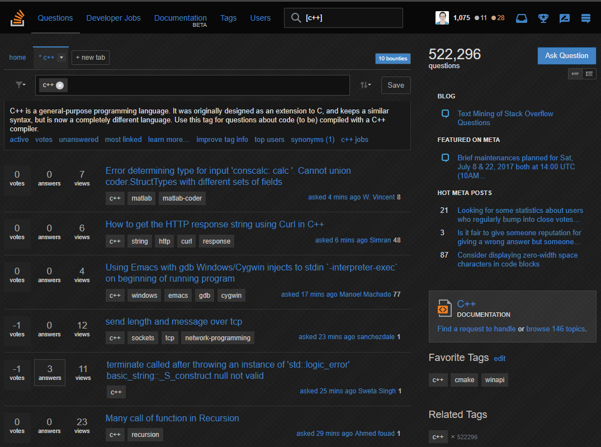

  
   
  
  
  
  
  

- This dark theme applied to Stack Overflow and almost all Stack Exchange sites (except [Gaming](http://gaming.stackexchange.com/) and [Area 51](http://area51.stackexchange.com/)).
- Install from [userstyles.org](http://userstyles.org/styles/35345) (with customization options) or [manually](https://raw.githubusercontent.com/StylishThemes/Stackoverflow-Dark/master/stackoverflow-dark.css).
- Stylus is available for [Firefox](https://addons.mozilla.org/en-US/firefox/addon/styl-us/), [Chrome](https://chrome.google.com/webstore/detail/stylus/clngdbkpkpeebahjckkjfobafhncgmne) and [Opera](https://addons.opera.com/en-gb/extensions/details/stylus/).
- Stylish is available for [Firefox](https://addons.mozilla.org/en-US/firefox/addon/2108/), [Chrome](https://chrome.google.com/extensions/detail/fjnbnpbmkenffdnngjfgmeleoegfcffe), [Opera](https://addons.opera.com/en/extensions/details/stylish/), [Safari](http://sobolev.us/stylish/) and [Firefox Mobile](https://addons.mozilla.org/en-US/firefox/addon/2108/).
- In versions 2.8.0+, this style will apply to *almost* all Stack Exchange sites.
- Use the [grunt build process](https://github.com/StylishThemes/StackOverflow-Dark/wiki/Build) to customize your StackOverflow Dark theme.
- Please refer to the [installation documentation](https://github.com/StylishThemes/StackOverflow-Dark/wiki/Install) for more details.

## Preview

## Available Syntax Highlighting Themes

|                         |                          |                       |                         |
|-------------------------|--------------------------|-----------------------|-------------------------|
| Atelier-cave-dark       | Atelier-dune-dark        | Atelier-estuary-dark  | Atelier-forest-dark     |
| Atelier-heath-dark      | Atelier-lakeside-dark    | Atelier-plateau-dark  | Atelier-savanna-dark    |
| Atelier-seaside-dark    | Atelier-sulphurpool-dark | Desert                | Doxy                    |
| Hemisu Dark             | Monokai                  | Sons of Obsidian      | Sunburst                |
| Tomorrow Night          | Tomorrow Night Blue      | Tomorrow Night Bright | Tomorrow Night Eigthies |
| Tranquil Heart          | Vibrant Ink              | VSCode Monaco         |                         |

\* Reference the [Themes wiki](https://github.com/StylishThemes/StackOverflow-Dark/wiki/Themes) for more details.

## Changelog

See the [full changelog](https://github.com/StylishThemes/Stackoverflow-Dark/wiki).

### Version 2.10.22 (2017-10-07)

* SO: Fix intellitab borders.

### Version 2.10.21 (2017-10-06)

* Global: Fix "per page" text on questions page having a border.

### Version 2.10.20 (2017-09-27)

* SO: Added code to fixed asked date and viewed #. See [PR #88](https://github.com/StylishThemes/StackOverflow-Dark/pull/88); thanks [@jmona789](https://github.com/jmona789)!
