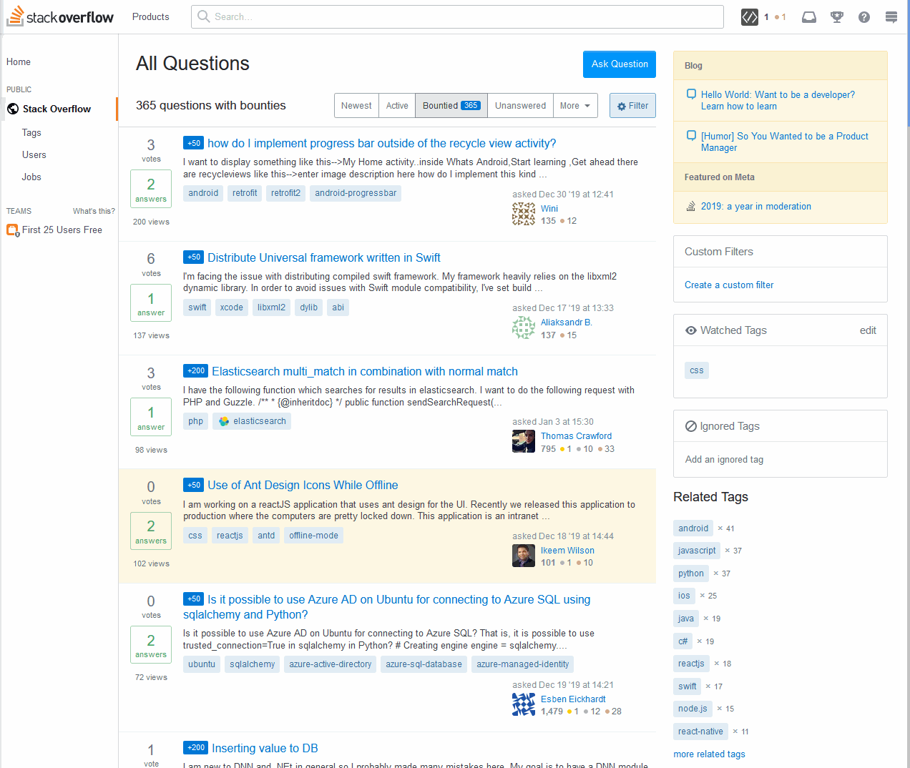

  
   
  
  
  
  
  

This dark theme applied to Stack Overflow and almost all Stack Exchange sites (except [Area 51](http://area51.stackexchange.com/)).

## Preview

## Installation

A userstyle manager is required, common ones include:

🎨 Stylus for [Firefox](https://addons.mozilla.org/en-US/firefox/addon/styl-us/), [Chrome](https://chrome.google.com/webstore/detail/stylus/clngdbkpkpeebahjckkjfobafhncgmne) or [Opera](https://addons.opera.com/en-gb/extensions/details/stylus/). 
🎨 xStyle for [Firefox](https://addons.mozilla.org/firefox/addon/xstyle/) or [Chrome](https://chrome.google.com/webstore/detail/xstyle/hncgkmhphmncjohllpoleelnibpmccpj).

Then:

📦 [Install the usercss](https://github.com/StylishThemes/StackOverflow-Dark/raw/master/stackoverflow-dark.user.css). Supports automatic updates.

## Additional styles

📦 [Install the StackOverflow Syntax Themes usercss](https://raw.githubusercontent.com/StylishThemes/Feature-Override-Styles/master/stackoverflow-syntax-themes.user.css) 
This style allows you to choose preset syntax themes for StackOverflow and associated sites.  

## Notes

- In versions 2.8.0+, this style will apply to *almost* all Stack Exchange sites.
- From version 5.0.0, the syntax themes are removed and added as separate theme switcher, this is because SO design upstream changed, see issue #218

## Contributions

If you would like to contribute to this repository, please...

1. 👓 Read the [contribution guidelines](./.github/CONTRIBUTING.md).
1.  [Fork](https://github.com/StylishThemes/StackOverflow-Dark/fork) or  [download](https://github.com/StylishThemes/StackOverflow-Dark/archive/master.zip) this repository.
1. 👌 Create a pull request!

Thanks to all that have [contributed](./AUTHORS) so far!
